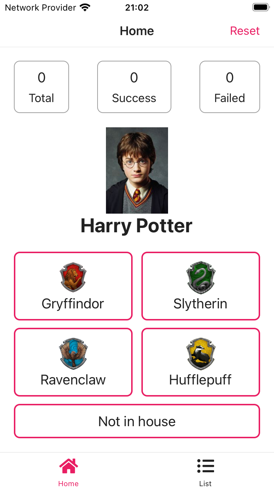
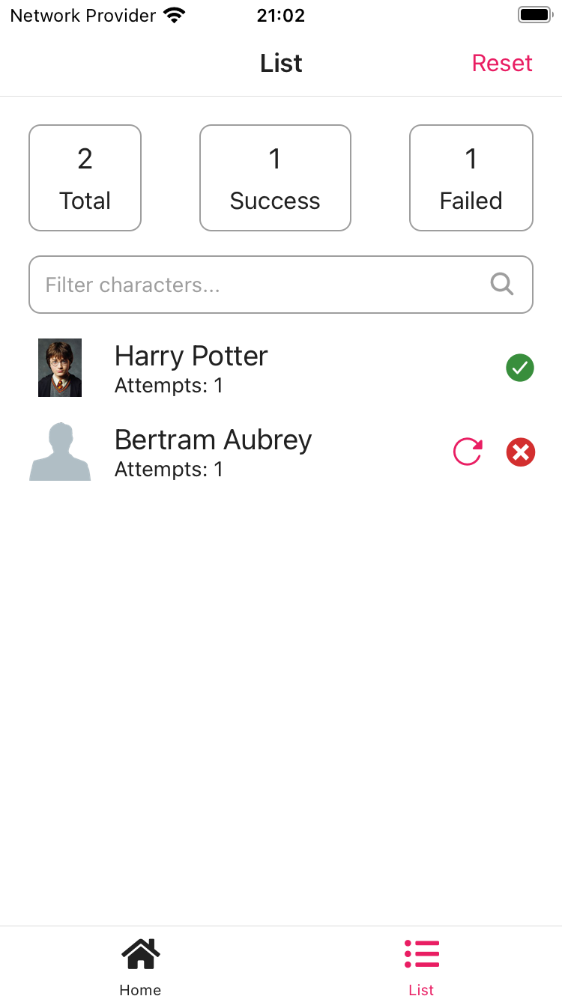
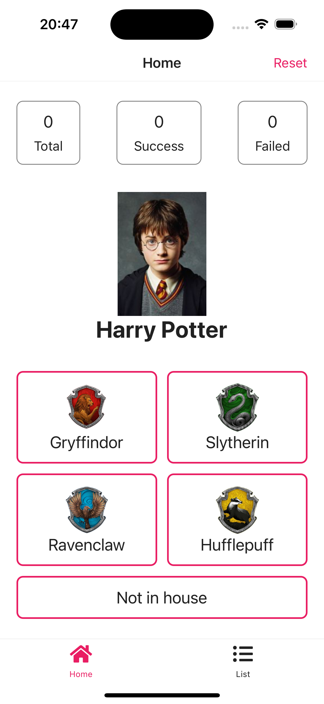
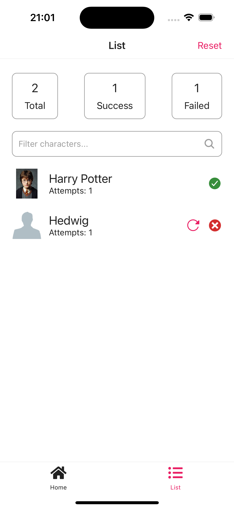
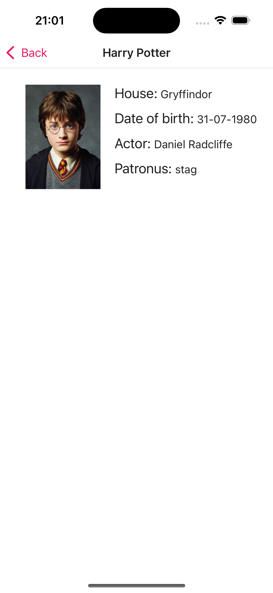
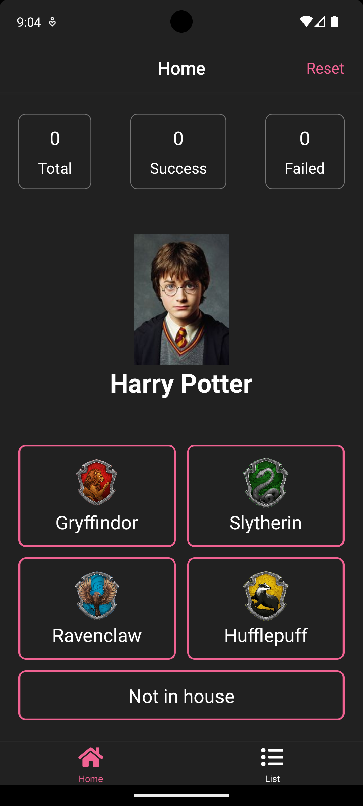
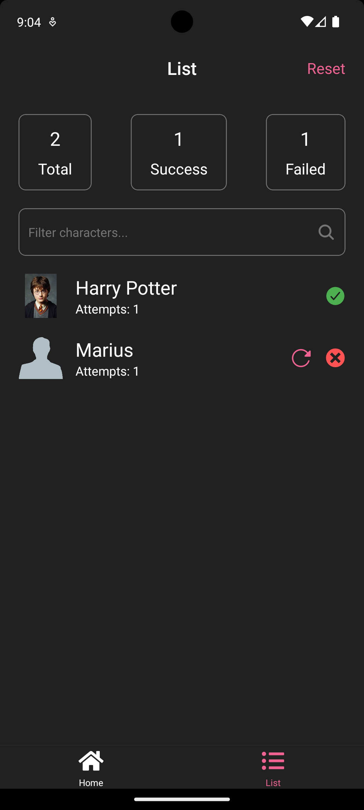
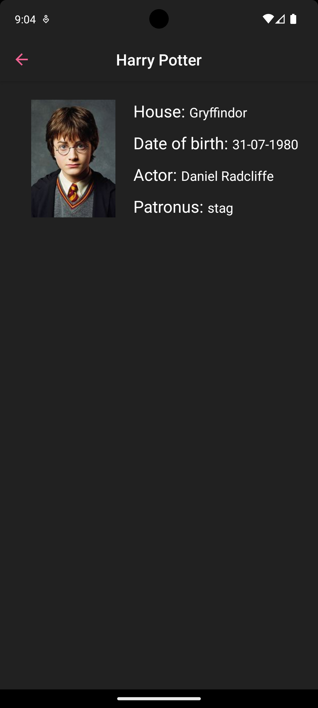

# MagicHat

---

My implementation of a [test task](https://github.com/MaksymZhuravel/magic-hat-test-task) for Mobile Developer role

### Features

- Pull to refresh the character
- Characters filtering by name
- Default character image if not provided by API
- Responsive layout: looks great on any iPhone or Android device
- A bonus from me: dark and light theme (depends on device settings)
- Stateful screens and “dummy” UI components
- `FlatList` items rendering optimization, aligned with guidelines from React Native documentation
- Configured `eslint` and `prettier`

### Demo

Watch a [video]([https://drive.google.com/drive/folders/1WRtKC28TjVIMo8hAs_LuG2s6O12Hiqc5?usp=drive_link](https://drive.google.com/drive/folders/1WRtKC28TjVIMo8hAs_LuG2s6O12Hiqc5?usp=sharing))
demonstrating app's functionality

### Screenshots

#### iPhone SE (3rd generation)

<div>
  
  
  
</div>

#### iPhone 15 Pro

<div>
  
  
  
</div>

#### Google Pixel 6

<div>
  
  
  
</div>

### Tech Stack

- _TypeScript_ - no comments :)
- _Expo_ - a framework [recommended](https://reactnative.dev/docs/environment-setup) by React Native team for any greenfield app
- _Expo router_ - a new file-based approach to routing
- _Zustand + Axios_ - a lightweight and easy-to-use state manager and HTTP client, respectively. This combination
is a great choice for small and mid-size projects, that's why they were picked instead of heavyweight solutions like
_React Query_ or _Redux Toolkit + RTK Query_.

### How to run the app

#### Using simulator

- iOS

    ```shell
    npm run ios
    ```

- Android

    ```shell
    npm run google-pixel-6
    ```

#### Using Expo Go app

Download Expo Go app from App Store or Google Play and scan the QR-code generated by this command:

```shell
npm run start
```
